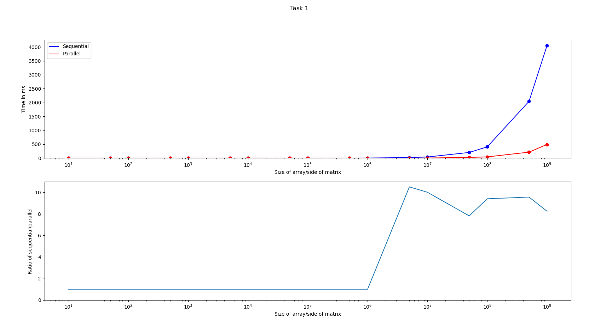
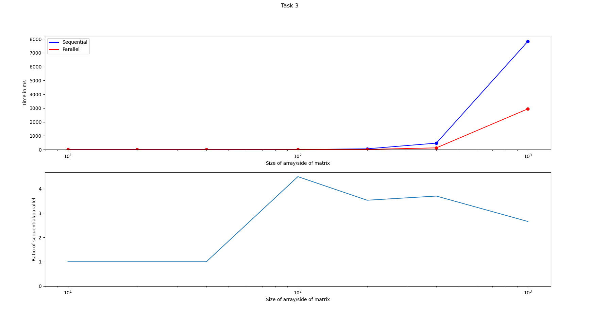

# Parallel computing task submissions
My (Prabhanjan Prabhu, 221CS234) submission for the parallel computing task for WEC systems/security recruitments.  
  <br>  

### Dependencies
- [Python3](https://www.python.org/)
- [GCC (G++)](https://gcc.gnu.org/)
- [matplotlib](https://matplotlib.org/)
- [OpenMPI](https://www.open-mpi.org/)  
  <br>

### Usage
_Note:_ tested everything on linux, not sure about how well everything will run on other operating systems.

To test out the performance of a certain task's parallel algorithm compared to the sequential one, run:
```
python3 test_script.py x
```
where x is the number of the task (1, 2 or 3).

This generates random arrays/matrices of different sizes, and then compares the time taken for the parallel and sequential algorithms. The final output is the times and lengths on the console, and graphs comparing the two.


The actual task files are named `task_1.cpp`, `task_2.cpp` and `task_3.cpp`. These can be edited to print the input and output sum/matrices, by uncommenting certain marked lines. However if edited, this will break the python test script, so upon editing the task files need to be manually compiled and run as follows:

```
g++ task_x.cpp -fopenmp -o <output_file>
./<output_file> n
```
where x is the task number, and n is the length of the array/side of matrix to be randomly generated.  
  <br>

## Performance and explanations
### Task 1

<p align="center"> <em> In task 1, the parallel algorithm performs ~8-10 times better than the sequential one.</em> </p>

The implementation is simply dividing the workload of a for loop across multiple threads. Each of these computes the sum of a certain number of elements of the array (modulo 1000000007 to prevent overflow) and stores it. The sums are then combined by adding them up. This can be done as the sum is commutative and the sum of each subsection is independent of the others. The time complexity is O(n).
<br>  
<br>

### Task 2

<p align="center"> <em> In task 2, the parallel algorithm performs ~3-6 times better than the sequential one.</em> </p>

The implementation is using a special class to implement matrices, and using Gaussian elimination to implement LU decomposition. Gaussian elimination involves selecting a pivot element, and then eliminating all elements below the pivot by adding/subtracting multiples of the pivot row to the rows below. The multiples are recorded and form the L matrix, and the remaining matrix after elimination is the U matrix. The step of adding/subtracting multiples of the pivot row to the rows below it can be parallelized as each row only depends on the pivot row and can be done simultaneously for each pivot. The algorithm also only does LU factorization and _does not_ take into account permutation (PA = LU factorization). The time complexity is O(n<sup>3</sup>).  
<br>  
<br>  

### Task 3

<p align="center"> <em> In task 3, the parallel algorithm performs ~3-4 times better than the sequential one.</em> </p>

The implementation is using a special class to implement matrices, and using Gauss-Jordan elimination to find the inverse. In this method a diagonal non-zero pivot element is selected, and the other elements in the same column are eliminated by adding/subtracting multiples of the pivot row. The same operations are applied in order to the unit matrix. The process is continued till the original matrix becomes a diagonal matrix. Then it is converted to a unit matrix by multiplying/dividing rows by constants, and the inverse is modified accordingly. In this case once again the step of adding/subtracting multiples of the pivot row can be parallelized. In case the pivot element is 0, rows are swapped to find a non-zero pivot. In case there is no non-zero pivot, the matrix inverse function returns zero matrix as the inverse to indicate it does not exist. (since zero matrix can never actually be the inverse of a matrix). The time complexity is O(n<sup>3</sup>).  
<br>  
<br>  

